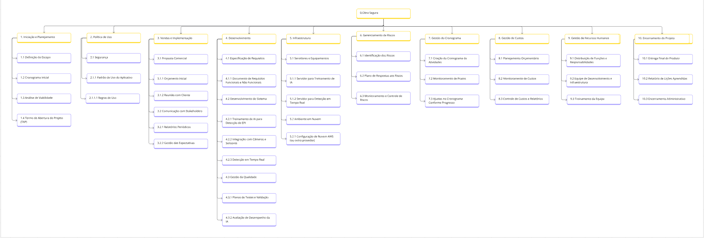
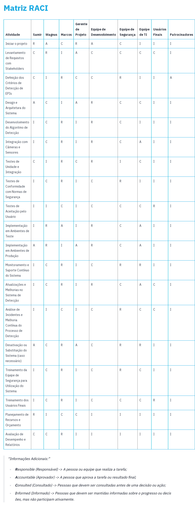

# Planejamento

> A fase de planejamento na gerência de projetos é um momento onde os detalhes do projeto são minuciosamente definidos para garantir uma execução bem-sucedida. 
> Durante essa etapa, os gerentes de projeto e suas equipes elaboram um plano abrangente que aborda aspectos como cronograma, orçamento, recursos necessários, riscos identificados e métodos de controle. 
> O objetivo é criar uma estrutura que guiará as atividades ao longo do projeto, garantindo que metas sejam alcançadas de maneira eficiente. 
> O plano de projeto não apenas define as tarefas específicas e suas interdependências, mas também estabelece critérios de sucesso e indicadores de desempenho. 
> A qualidade do planejamento influencia diretamente a capacidade da equipe em cumprir prazos, alocar recursos eficientemente e lidar com desafios que possam surgir durante a execução.

# Estrutura do Documento

- [Fase de Planejamento](#planejamento)
- [Escopo do Projeto](#escopo-do-projeto)
- [Estrutura Analítica do Projeto](#estrutura-analítica-do-projeto)
- [Matriz de Responsabilidades](#matriz-de-responsabilidades)
- [Cronograma do Projeto](#cronograma-do-projeto)
- [Orçamento do Projeto](#orçamento-do-projeto)
- [Planos de Gerenciamento](#planos-de-gerenciamento)
  - [Plano de Qualidade](#plano-de-qualidade)
  - [Plano de Aquisição](#plano-de-aquisição)
  - [Plano de Comunicação](#plano-de-comunicação)
  - [Plano de Riscos](#plano-de-riscos)

-----
```diff
+ Tarefa 04:
+ Escopo e Estrutura Analítica do Projeto
```

## Escopo do Projeto

O escopo do projeto define os limites, objetivos e entregáveis, estabelecendo clareza sobre o que será realizado e o que está excluído. Ele assegura a alocação adequada de recursos, evita desvios dos objetivos e garante que as expectativas dos stakeholders sejam atendidas.

A definição do escopo inclui documentação detalhada dos requisitos, restrições e premissas do projeto. Ao longo do ciclo de vida do projeto, a gestão do escopo também inclui o controle de mudanças, garantindo que qualquer ajuste seja avaliado quanto ao seu impacto e aprovado de maneira adequada.

### Objetivo do Projeto
O objetivo do projeto **Obra Segura** é detectar em tempo real Equipamentos de Proteção Individual (EPIs) em obras de construção civil.

### Limites do Projeto
Os seguintes itens estão fora do escopo do projeto:

- Treinamento de modelo de linguagem natural (LLM);
- Pesquisa de viabilidade do mercado;
- Desenvolvimento de hardware proprietário para captura de imagens;
- Monitoramento de condições ambientais como temperatura e umidade;
- Suporte a plataformas de nuvem que não sejam AWS;
- Implementação de funcionalidades de gestão de projetos dentro do sistema;
- Desenvolvimento de aplicativos móveis nativos para plataformas específicas.

### Restrições
As principais restrições para o projeto são:

- Interface para acesso ao conteúdo;
- Verificar se uma pessoa foi detectada sem EPI;
- Salvar imagens de momentos de violação;
- Detectar a presença de EPI.

### Premissas
As premissas para o início do projeto incluem:

- Assinatura de contrato de prestação de serviços;
- Apresentação de garantias definidas no contrato;
- Disponibilidade de acesso aos recursos e serviços AWS necessários;
- Aquisição e configuração das câmeras para a segurança nas obras;
- Treinamento inicial da equipe de segurança para uso do sistema.

### Marcos Agendados e Entregas

A tabela a seguir apresenta os marcos e entregas previstas para o projeto.

| ID  | Marco do Projeto                                                          | 
|-----|---------------------------------------------------------------------------|
| M-001 | Liberação do sistema para cadastro de informações e configuração inicial. |
| M-002 | Permissão para uso do sistema por usuários focais.                        |
| M-003 | Conclusão da integração com câmeras para a segurança.                     |
| M-004 | Desenvolvimento e integração do painel de monitoramento em tempo real.    |
| M-005 | Testes de desempenho e conformidade.                                      |
| M-006 | Entrega final da solução e início do treinamento do usuário final.        |
| M-007 | Auditoria de conformidade com segurança após 3 meses de uso.              |
| M-008 | Lançamento da versão 2.0 com melhorias baseadas no feedback do usuário.   |


# Estrutura Analítica do Projeto


  
- [Estrutura Analítica do Projeto - Editável](https://miro.com/welcomeonboard/NXZpUkxCcEs4V2s1ekp5VFF5ZWx1cjlkNnFjZWF2aUFGdFBMbGFSUG01cE1XZVJFUjFUdXZsTTl6NzJyZE9laHwzNDU4NzY0NTMwNDE2NDIxNjEyfDI=?share_link_id=425366541402)

```diff
+ Tarefa 04:
+ Fim da seção a ser atualizada.
```

-----
```diff
+ Tarefa 05:
+ Matriz de Responsabilidades (RACI)
```

# Matriz de Responsabilidades (RACI)

| **Atividade**                                                         | **Samir** | **Wagnus** | **Marcos** | **Gerente de Projeto** | **Equipe de Desenvolvimento** | **Equipe de Segurança** | **Equipe de TI** | **Usuários Finais** | **Patrocinadores** |
|-----------------------------------------------------------------------|-----------|------------|------------|------------------------|-------------------------------|-------------------------|------------------|---------------------|--------------------|
| Iniciar o projeto                                                     | R         | A          | C          | R                      | A                             | C                       | I                | I                   | I                  |
| Levantamento de Requisitos com Stakeholders                            | C         | R          | I          | A                      | C                             | C                       | C                | C                   | I                  |
| Definição dos Critérios de Detecção de EPIs                            | C         | I          | R          | C                      | C                             | R                       | I                | I                   | A                  |
| Design e Arquitetura do Sistema                                        | A         | C          | I          | A                      | R                             | C                       | C                | I                   | I                  |
| Desenvolvimento do Algoritmo de Detecção                               | I         | C          | R          | I                      | R                             | C                       | I                | I                   | I                  |
| Integração com Câmeras e Sensores                                      | I         | C          | R          | I                      | R                             | C                       | A                | I                   | I                  |
| Testes de Unidade e Integração                                         | C         | I          | R          | C                      | R                             | I                       | C                | I                   | I                  |
| Testes de Conformidade com Normas de Segurança                         | I         | C          | R          | I                      | C                             | R                       | I                | I                   | I                  |
| Testes de Aceitação pelo Usuário                                       | I         | I          | C          | I                      | C                             | C                       | C                | R                   | I                  |
| Implementação em Ambientes de Teste                                    | I         | R          | A          | I                      | R                             | C                       | A                | I                   | I                  |
| Implementação em Ambientes de Produção                                 | A         | R          | I          | A                      | R                             | C                       | A                | I                   | I                  |
| Monitoramento e Suporte Contínuo do Sistema                            | I         | C          | R          | I                      | C                             | R                       | R                | I                   | I                  |
| Atualizações e Melhorias no Sistema de Detecção                        | I         | C          | R          | I                      | R                             | C                       | A                | C                   | I                  |
| Análise de Incidentes e Melhoria Contínua do Processo de Detecção      | I         | I          | C          | I                      | C                             | R                       | C                | C                   | I                  |
| Desativação ou Substituição do Sistema (caso necessário)               | A         | C          | R          | A                      | C                             | R                       | R                | I                   | I                  |
| Treinamento da Equipe de Segurança para Utilização do Sistema          | I         | C          | R          | I                      | C                             | R                       | C                | I                   | I                  |
| Treinamento dos Usuários Finais                                        | I         | C          | R          | I                      | C                             | C                       | C                | R                   | I                  |
| Planejamento de Recursos e Orçamento                                   | R         | I          | C          | C                      | I                             | I                       | I                | I                   | I                  |
| Avaliação de Desempenho e Relatórios                                   | C         | C          | R          | I                      | I                             | I                       | I                | I                   | I                  |

> Informações Adicionais:
> * **R**esponsible (Responsável) -> A pessoa ou equipe que realiza a tarefa;
> * **A**ccountable (Aprovador) -> A pessoa que aprova a tarefa ou resultado final;
> * **C**onsulted (Consultado) -> Pessoas que devem ser consultadas antes de uma decisão ou ação;
> * **I**nformed (Informado) -> Pessoas que devem ser mantidas informadas sobre o progresso ou decisões, mas não participam ativamente.

<!--
> A Matriz de Responsabilidades é uma ferramenta para definir e indicar as responsabilidades de cada membro da equipe em relação às atividades do projeto. 
> Também conhecida como RACI (Responsável, Aprovador, Consultado e Informado), essa matriz atribui papéis específicos a cada envolvido, indicando quem é responsável pela execução de uma tarefa, quem deve aprovar, quem precisa ser consultado e quem deve ser mantido informado. 
> Ao criar uma visão visual e estruturada das responsabilidades, a matriz RACI minimiza ambiguidades e conflitos de papel.
> Essa ferramenta não apenas esclarece as expectativas em termos de contribuições individuais, mas também contribui para um ambiente de trabalho mais organizado e transparente, resultando em uma gestão de projeto mais eficaz e bem-sucedida.

> Informações Adicionais:
> * **R**esponsible -> Executor (pessoa(s) que executará(ão)/desenvolverá(ão) a atividade)
> * **A**ccountable -> Responsável (pessoa responsável por aprovar a atividade)
> * **C**onsulted   -> Consultado (especialista consultado sobre a atividade ou parte dela)
> * **I**nformed    -> Informado (pessoas interessadas no projeto que devem ser informadas sobre a execução).
> 
> Link de auxílio: https://www.forbes.com/advisor/business/raci-chart/
-->
<!-- 
> Crie uma nova imagem da Estrutura Analítica do Projeto. Não se esqueça de adicionar o documento editável no repositório.
--->



### Documento Editável

<!-- 
> Você deve atualiza o seguinte link (ou link correspondente), como o arquivo editável da Matriz RACI:
-->
- [Matriz de Responsabilidades (RACI) - Editável](artefatos/matriz_responsabilidades_raci.docx)

```diff
+ Tarefa 05:
+ Fim da seção a ser atualizada.
```

-----
```diff
+ Tarefa 07:
+ Cronograma do Projeto
```

# Cronograma do Projeto

......  DESCREVA EM LINHAS GERAIS O CRONOGRAMA DO SEU PROJETO AQUI ......

> O cronograma do projeto fornece uma representação temporal detalhada de todas as atividades, marcos e eventos ao longo do ciclo de vida do projeto. 
> Elaborado durante o planejamento, o cronograma é uma ferramenta que oferece uma visão das interdependências entre as tarefas, alocando recursos e definindo prazos para as entregas.
> Utilizando técnicas como a análise de rede (PERT/CPM) e estimativas de duração, o cronograma ajuda na identificação de caminhos críticos, permitindo aos gestores de projeto otimizar recursos, antecipar potenciais atrasos e tomar decisões. 
> Além disso, o cronograma serve como um guia para monitorar o progresso, comunicar efetivamente com a equipe e as partes interessadas, e ajustar estratégias para garantir a conclusão bem-sucedida do projeto dentro dos prazos estabelecidos.

### Documento Editável

> Você deve atualiza o seguinte link (ou link correspondente), como o arquivo editável do Cronograma do Projeto:
- [Cronograma e Orçamento do Projeto - Editável](artefatos/cronograma_orcamento.pod)

```diff
+ Tarefa 07:
+ Fim da seção a ser atualizada.
```

-----
```diff
+ Tarefa 08:
+ Orçamento do Projeto
```

# Orçamento do Projeto

......  DESCREVA EM LINHAS GERAIS O ORÇAMENTO DO SEU PROJETO AQUI ......

> O orçamento do projeto envolve a estimativa e alocação de recursos financeiros necessários para a execução bem-sucedida do projeto, abrangendo custos diretos e indiretos, despesas operacionais, investimentos em equipamentos, pessoal, entre outros. 
> O desenvolvimento do orçamento deve considerar variáveis como riscos, imprevistos e mudanças no escopo. 
> Uma vez estabelecido, o orçamento serve como guia para a utilização eficiente dos recursos financeiros ao longo do projeto. 
> A gestão do orçamento não apenas ajuda a controlar os custos, mas também fornece transparência e prestação de contas, permitindo que gestores tomem decisões informadas e evitem surpresas financeiras ao longo do ciclo de vida do projeto. 
> Assim, o orçamento contribui para o sucesso do projeto, garantindo a viabilidade econômica e a entrega dentro das expectativas financeiras estabelecidas.

### Documento Editável

> Você deve atualiza o seguinte link (ou link correspondente), como o arquivo editável do Orçamento do Projeto:
- [Cronograma e Orçamento do Projeto - Editável](artefatos/cronograma_orcamento.pod)

```diff
+ Tarefa 08:
+ Fim da seção a ser atualizada.
```

# Planos de Gerenciamento

> Os planos de gerenciamento do projetos consolidam as diretrizes e estratégias para a execução bem-sucedida de um empreendimento. 
> Ele abrange diversos aspectos, como escopo, cronograma, custos, riscos, qualidade, recursos humanos, comunicação e aquisições, proporcionando uma visão abrangente e integrada do projeto. 
> Este plano funciona como um guia mestre que orienta a equipe de projeto e as partes interessadas ao longo do ciclo de vida do projeto, estabelecendo expectativas, responsabilidades e processos. 
> Além disso, serve como um instrumento de comunicação, alinhando as expectativas entre os membros da equipe e as partes interessadas, mitigando riscos e fornecendo uma estrutura sólida para a tomada de decisões. 

```diff
+ Tarefa 09:
+ Checklist de Qualidade
```

## Plano de Qualidade


# Detecção Automática de EPIs em Construção Civil

O projeto tem como objetivo desenvolver uma solução automatizada para a detecção de Equipamentos de Proteção Individual (EPIs) em ambientes de construção civil, utilizando a plataforma AWS e suas ferramentas de inteligência artificial. A segurança no ambiente de trabalho é uma prioridade em obras de construção, e a ausência de EPIs pode resultar em acidentes graves. Com o uso de tecnologias avançadas, como visão computacional e machine learning, este projeto visa identificar em tempo real a presença ou ausência dos EPIs obrigatórios em trabalhadores, proporcionando um sistema de monitoramento eficiente e proativo.

```diff
+ Tarefa 09:
+ Checklist de Qualidade
```

## Plano de Qualidade

O Plano de Qualidade para o projeto de detecção automática de Equipamentos de Proteção Individual (EPIs) em ambientes de construção civil é estruturado para garantir a entrega de uma solução confiável, eficiente e alinhada às exigências do setor. Por meio de processos rigorosos de validação e verificação, o plano assegura que o sistema desenvolvido seja capaz de identificar em tempo real a presença ou ausência de EPIs obrigatórios, contribuindo para a segurança no ambiente de trabalho.

Estratégias de Qualidade
Validação de Algoritmos de Visão Computacional
Garantir que o modelo de machine learning seja treinado com dados representativos, minimizando falsos positivos ou negativos na identificação de EPIs. Os dados de entrada incluem imagens coletadas em ambientes reais de construção civil.

Testes de Desempenho
Realizar testes para verificar a taxa de acerto e a latência do sistema, garantindo que o tempo de resposta atenda às necessidades operacionais, mesmo em cenários com múltiplos trabalhadores.

Integração com AWS
Validar a implementação de serviços AWS, como Amazon Rekognition e Lambda, para assegurar que a arquitetura da solução seja escalável, segura e resiliente.

Conformidade com Normas de Segurança do Trabalho
O projeto seguirá as diretrizes regulamentares nacionais, como a Norma Regulamentadora 6 (NR-6), assegurando que os EPIs identificados pelo sistema sejam compatíveis com os padrões exigidos.

Monitoramento Contínuo
Implementar processos de monitoramento em tempo real para avaliar a eficácia do sistema e corrigir possíveis falhas antes que impactem os usuários.


> Referência - Conceitual
> * https://www.researchgate.net/publication/230636169_Software_Quality_Assurance

> Normas de Qualidade:
> * https://repositorium.uminho.pt/bitstream/1822/27266/1/Tese_MEI_PG19676_Juliana%20Oliveira.pdf
> * https://cin.ufpe.br/~processos/TAES3/Livro/00-LIVRO/07-Normas%20ISO%20e%20Qualidade%20de%20Software-v6_CORRIGIDO.pdf

> Métricas de software:
> * https://repositorio.unicamp.br/Busca/Download?codigoArquivo=489087
> * https://lume.ufrgs.br/bitstream/handle/10183/66095/000870909.pdf?sequence=1
> * https://www.computerweekly.com/br/tip/23-metricas-de-desenvolvimento-de-software-que-devem-ser-monitoradas

> Processos de Garantia da Qualidade de Software
> * https://ceur-ws.org/Vol-3200/paper22.pdf
> * https://citeseerx.ist.psu.edu/document?repid=rep1&type=pdf&doi=d6bd60206282a2d4449e414e81a703612ef78a0c
> * https://www.testbytes.net/blog/quality-assurance-process-methodology/
> * https://www.projectmanager.com/blog/quality-assurance-and-testing

> Você pode utilizar como referência o seguinte documento:
> [Checklist de Qualidade](artefatos/checklist_qualidade.docx)

### Artefatos a serem verificados

| Artefato                 | Tipo Verif.   | Data        | Responsável      | Métrica                | Data Correção | Ação Não Conform.        | Resp. Avaliação   | Resp. Correção   |
|--------------------------|---------------|-------------|------------------|------------------------|---------------|--------------------------|-------------------|------------------|
| Código fonte             | Inspeção      | 2024-11-25  | João Silva       | Cobertura de Testes    | 2024-11-30    | Revisar implementação    | Maria Oliveira    | Pedro Andrade    |
| Documentação técnica     | Revisão       | 2024-11-26  | Ana Martins      | Completeness checklist | 2024-12-01    | Atualizar documentação   | João Silva        | Ana Martins      |
| Protótipo funcional      | Teste         | 2024-11-27  | Pedro Andrade    | Taxa de Detecção EPI   | 2024-12-02    | Corrigir algoritmo       | Maria Oliveira    | João Silva       |

### Padrões e Normas Utilizadas

| Nome                     | Descrição                                           | 
|--------------------------|---------------------------------------------------|
| ISO 9001                 | Sistema de Gestão da Qualidade                    |
| ISO/IEC 27001            | Segurança da Informação                          |
| AWS Well-Architected     | Melhores práticas em arquitetura AWS             |

### Ambiente das Atividades de Qualidade

| Ambiente                 | Descrição                                         | 
|--------------------------|---------------------------------------------------|
| Ambiente de Testes       | Servidores AWS com simulação de obra             |
| Ambiente de Produção     | Infraestrutura real de monitoramento             |

### Equipe de Qualidade

| Nome                     | Responsabilidade                                 | 
|--------------------------|-------------------------------------------------|
| João Silva               | Garantia de qualidade do código                 |
| Ana Martins              | Revisão de documentação                         |
| Pedro Andrade            | Validação de protótipos                         |

### Metodologias de Qualidade Utilizadas

| Nome                     | Descrição                                         | 
|--------------------------|---------------------------------------------------|
| TDD (Test Driven Development) | Desenvolvimento orientado a testes           |
| Checklist de Qualidade   | Verificação de conformidade com requisitos       |
| Revisão por Pares        | Avaliação colaborativa de entregas               |

```diff
+ Tarefa 09:
+ Fim da seção a ser atualizada.
```


```diff
+ Tarefa 10:
+ Especificação de Produto para Aquisição
```

## Plano de Aquisição

> O Plano de Aquisições define o processo relacionado à aquisição de bens e serviços necessários para a execução do projeto. 
> Este plano abrange a identificação de necessidades, a seleção de fornecedores, a elaboração de contratos, e a gestão do relacionamento com os fornecedores durante do ciclo de vida do projeto. 
> O Plano de Aquisições visa garantir a aquisição eficiente e eficaz dos recursos necessários, minimizando riscos e custos. 
> Além disso, ele proporciona transparência nas relações com fornecedores, promovendo a conformidade com os prazos estabelecidos e padrões de qualidade. 

### Documento Editável

> Você deve atualiza o seguinte link (ou link correspondente), como o arquivo editável de geração da WBS:
- [Especificação Produto Aquisição - Editável](https://sgapucminasbr-my.sharepoint.com/personal/1441742_sga_pucminas_br/_layouts/15/guestaccess.aspx?share=EdfXQptvYItMm2fhKDMcYdgB5R2lQjzvbVo-Q1A8r0k35w&e=UyM6Hc)


```diff
+ Tarefa 10:
+ Fim da seção a ser atualizada.
```

```diff
+ Tarefa 11:
+ Plano de Comunicação
```

## Plano de Comunicação

> O Plano de Comunicação estabelece estratégias e diretrizes para facilitar a troca de informações entre os membros da equipe e as partes interessadas.  
> Este plano abrange aspectos como os meios de comunicação, a frequência das atualizações, os canais de distribuição de informações e os responsáveis pela comunicação.  
> Uma comunicação eficiente não apenas previne mal-entendidos e conflitos, mas também fortalece o engajamento da equipe e o apoio das partes interessadas.  

Você pode utilizar como referência o seguinte documento:  
- [Plano de Gerenciamento de Comunicação - Editável](artefatos/plano_comunicacao.docx)

## Plano de Comunicação do Projeto

| **Entregável**                     | **Público Alvo**              | **Met. Comunicação** | **Frequência**  | **Responsável**     |
|------------------------------------|-------------------------------|----------------------|-----------------|---------------------|
| Ata de reunião                     | Gerentes e Stakeholders       | Reunião virtual      | Quinzenal       | João Silva          |
| Declaração de escopo               | Equipe técnica e clientes     | E-mail               | Mensal          | Maria Oliveira      |
| WBS                                | Gerentes de projeto           | Reunião presencial   | Uma vez         | Pedro Andrade       |
| Dicionário da WBS                  | Equipe de desenvolvimento     | Documento interno    | Ad hoc          | Ana Martins         |
| Cronograma                         | Todos os stakeholders         | Portal do projeto    | Atualizações automáticas | João Silva |
| Lista de Riscos                    | Gerentes e consultores        | Relatório PDF        | Mensal          | Maria Oliveira      |
| Plano de qualidade                 | Engenheiros e analistas       | Relatório interno    | Trimestral      | Pedro Andrade       |
| Plano de projeto                   | Stakeholders e gerentes       | Apresentação         | Bimensal        | Ana Martins         |
| Relatório de Progresso             | Stakeholders                  | Reunião presencial   | Mensal          | João Silva          |
| Relatório de Aderência ao Processo | Supervisores                  | Documento interno    | Semanal         | Pedro Andrade       |
| Checklists de Inspeção             | Equipe de auditoria           | Portal interno       | Conforme necessário | Ana Martins      |

> **Legenda:**  
> - **Público Alvo**: A quem se destina a comunicação.  
> - **Método de Comunicação**: E-mail, reunião presencial, reunião virtual, etc.  
> - **Frequência**: Diária, semanal, quinzenal, mensal, etc.  
> - **Responsável**: Pessoa responsável pela comunicação.  

---

## Plano de Gerência de Comunicação

### Ferramentas utilizadas:
- [Microsoft Teams](https://www.microsoft.com/pt-br/microsoft-teams/group-chat-software) – Comunicação de equipe e reuniões virtuais.  
- [Miro](https://miro.com) – Gerenciamento de tarefas e progresso.  
- [One Drive](https://onedrive.live.com) – Armazenamento e compartilhamento de documentos.  

### Papéis e Responsabilidades:
- João Silva: Comunicação interna com a equipe técnica.  
- Maria Oliveira: Relatórios e comunicação com stakeholders externos.  
- Pedro Andrade: Organização e distribuição dos documentos do projeto.  
- Ana Martins: Garantia de conformidade com os padrões de comunicação.  

### Princípios gerais:
- **Clareza**: Todas as mensagens devem ser objetivas e de fácil compreensão.  
- **Impessoalidade**: O foco deve estar no trabalho, e não nas pessoas.  
- **Cordialidade**: Manter tom respeitoso em todas as comunicações.  
- **Transparência**: Informações devem ser compartilhadas de forma aberta e acessível.  

### Plano de Gerência de Configuração:
Para controle e distribuição de versões, utilizaremos o **GitHub**, com um repositório dedicado ao projeto para versionamento de documentos e arquivos técnicos.  

```diff
+ Tarefa 11:
+ Fim da seção a ser atualizada.
```

```diff
+ Tarefa 12:
+ Riscos do Projeto
```

## Plano de Riscos

......  COLOQUE AQUI O SEU TEXTO ......


> O plano de riscos busca antecipar, avaliar e mitigar os desafios potenciais que podem surgir ao longo do projeto. 
> Este documento estratégico oferece uma visão global dos riscos, categorizando-os e delineando estratégias para lidar com cada uma das possíveis adversidades. 
> Inicialmente, é realizada a identificação detalhada dos riscos, abrangendo desde ameaças imprevistas até oportunidades que podem ser exploradas. 
> Uma vez catalogados, os riscos são avaliados quanto à sua probabilidade de ocorrência e impacto, permitindo a priorização e foco em áreas críticas.
>
> O plano de riscos não apenas destaca os perigos em potencial, mas também estabelece respostas e estratégias de contingência. 
> Isso inclui a definição de ações preventivas para mitigar riscos antes que se materializem, bem como estratégias de mitigação para minimizar seu impacto se ocorrerem. 
> Além disso, a identificação de pontos de monitoramento contínuo ao longo do projeto permite uma resposta ágil às mudanças nas condições do ambiente.
>
> Você pode utilizar como referência o seguinte documento:
- [Plano de Gerenciamento de Riscos - Editável](artefatos/plano_riscos.xls)

| Categoria do Risco  | Descrição do Risco | Impacto       | Risco         | Medidas de Prevenção (Contramedidas) | Medidas de Contingência (Mitigação) | 
|---------------------|--------------------|---------------|---------------|--------------------------------------|-------------------------------------|
|                     |                    |               |               |                                      |                                     |
|                     |                    |               |               |                                      |                                     |
|                     |                    |               |               |                                      |                                     |
|                     |                    |               |               |                                      |                                     |
|                     |                    |               |               |                                      |                                     |
|                     |                    |               |               |                                      |                                     |
|                     |                    |               |               |                                      |                                     |
|                     |                    |               |               |                                      |                                     |
|                     |                    |               |               |                                      |                                     |
|                     |                    |               |               |                                      |                                     |

> Indique:
> Categoria do Risco: *ex.: Cliente, Cronograma, Orçamento, Aquisição de produtos, etc*
> Descrição do Risco: *ex.: Cliente não aparenta ter muito interesse no projeto*
> Impacto: *Baixo / Médio / Alto*
> Risco: *Baixo / Médio / Alto*
> Medidas de Prevenção: *Medidas que devem ser adotadas para evitar que o risco se concretize*
> Medidas de Contingência: *Medidas que devem ser adotadas caso o risco se concretize*
>
> *Obs.: Para determinar o risco considere a seguinte combinação entre Probabilidade e Impacto:

| Probabilidade | Impacto       | Risco         |
|---------------|---------------|---------------|
| Baixo         | Baixo         | Baixo         |
| Médio         | Médio         | Médio         |
| Alto          | Alto          | Alto          |
| Baixo         | Médio         | Médio         |
| Médio         | Baixo         | Médio         |
| Baixo         | Alto          | Médio         |
| Alto          | Baixo         | Médio         |
| Médio         | Alto          | Alto          |
| Alto          | Médio         | Alto          |


```diff
+ Tarefa 12:
+ Fim da seção a ser atualizada.
```

-----


